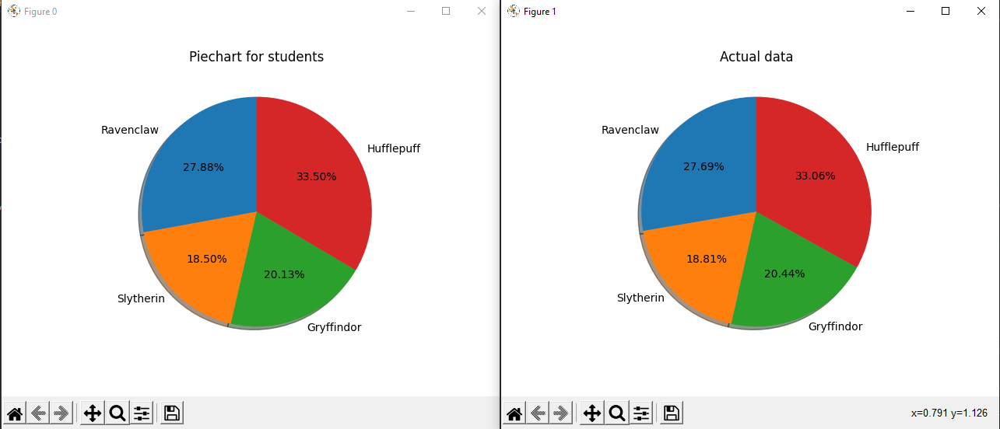

# Datascience X Logistic Regression [(subject)](https://cdn.intra.42.fr/pdf/pdf/19502/fr.subject.pdf)


Dans ce projet DataScience x Logistic Regression, vous allez poursuivre votre exploration du Machine Learning en ajoutant divers outils à votre escarcelle.
In this DataScience x Logistic Regression project, you will continue your exploration of Machine Learning by adding various tools to your purse.

You will implement a linear classification model, in the continuity of the subject
linear regression: a logistic regression.

In summary:
* You will learn how to read a dataset, visualize it in different ways, select and clean your data.
* You will set up a logistic regression which will allow you to solve classification problems.

## **How to install**

Create a virtual environment and activate it

On windows:

```bash
python -m venv venv
.\venv\Scripts\activate.bat
```

Install the pre-requirement:
```bash
pip install -U -r pre-requirements.txt
```

Execute `setup.py`:

* for dev:
```bash
pip install --editable .[dev]
```
* For user:
```bash
pip install .
```

## **How to run**

### **Data Visualization Part** : 

There is 4 programs dedicated to Data Science:

* describe is use for collecting datas in the dataset then display some informations about
```bash
> describe data\dataset_train.csv -h
usage: describe [-h] dataset

DataScience Describe program.

positional arguments:
  dataset     input a csv file.

optional arguments:
  -h, --help  show this help message and exit

> 
           Arithmancy    Astronomy  ...       Charms       Flying
Count     1566.000000  1568.000000  ...  1600.000000  1600.000000
Mean     49634.570243    39.797131  ...  -243.374409    21.958012
Std      16674.479577   520.132330  ...     8.780895    97.601087
Min     -24370.000000  -966.740546  ...  -261.048920  -181.470000
25%      38511.500000  -489.551387  ...  -250.652600   -41.870000
50%      49013.500000   260.289446  ...  -244.867765    -2.515000
75%      60811.250000   524.771949  ...  -232.552305    50.560000
Max     104956.000000  1016.211940  ...     0.000000   279.070000
Unique    1540.000000  1568.000000  ...  1600.000000  1546.000000
Freq         2.000000     1.000000  ...     1.000000     3.000000

[10 rows x 13 columns]
```


* histogram display a histogram of wich feature have homogenous scores between the 4 houses
```bash
> histogram data\dataset_train.csv -h
usage: histogram [-h] dataset

DataScience Histogram program

positional arguments:
  dataset     input a csv file.

optional arguments:
  -h, --help  show this help message and exit
```


* scatter_plot regroup two features that are similare on scores
```bash
> scatter_plot data\dataset_train.csv -h
usage: scatter_plot [-h]
                    dataset [feature_1]
                    [feature_2]

DataScience Scatter_plot program.

positional arguments:
  dataset     input a csv file.
  feature_1
  feature_2

optional arguments:
  -h, --help  show this help message and
              exit
```


* pair_plot regrouping all data vs all data
```bash
> pair_plot data\dataset_train.csv -h
usage: pair_plot [-h] dataset

DataScience Pair_plot program.

positional arguments:
  dataset     input a csv file.

optional arguments:
  -h, --help  show this help message and exit
```


### **Logistic Regression Part**
* logreg_train is use to get weights from the train dataset for be used in predict program.

```bash
> logreg_train data\dataset_train.csv -h
usage: logreg_train [-h] [-e EPOCHS] [-s] [-lo] [-l log-level] [-lr LR] [-a ACCURACY] dataset

Logistic regression training program for DataScience X Logistic Regression project.

positional arguments:
  dataset               input a csv file.

optional arguments:
  -h, --help            show this help message and exit
  -e EPOCHS, --epochs EPOCHS
                        Epochs
  -s, --show            Show some graphic for comprehension.
  -lo, --loss           Show graphic function of loss for each versus of features.
  -l log-level, --level log-level
                        Choices: ERROR, WARNING, INFO, DEBUG. The parameter set by default is INFO.
  -lr LR, --lr LR       Learning rate
  -a ACCURACY, --accuracy ACCURACY
                        Minimal accuracy, Set to 97 by default.
```

* logreg_predict use for predicting in wich house the student choose will go.

```bash
> logreg_predict data\dataset_test.csv weights.csv -h
usage: logreg_predict [-h] [-l log-level] [-p] dataset weights

Logistic regression predict program for DataScience X Logistic Regression project.

positional arguments:
  dataset               input a csv file with the dataset.
  weights               input a csv file with the weights.

optional arguments:
  -h, --help            show this help message and exit
  -l log-level, --level log-level
                        Choices: ERROR, WARNING, INFO, DEBUG. The parameter set by default is INFO.
  -p, --piechart        print a piechart for the results
```

On the predict program, if you give a dataset with hogwarts houses already filled and the option -p, you'll get a comparison of the houses obtained by the program and the houses already in the dataset.

example:


### **Bonus script**

We add a little script usefull for compare if a result given by predict is good or not with an correct prediction:

```bash
> check  houses.csv data\dataset_truth.csv -h
usage: check [-h] [-l log-level] dataset1 dataset

positional arguments:
  dataset1              First dataset to compare.
  dataset               Second dataset to compare.

optional arguments:
  -h, --help            show this help message and exit
  -l log-level, --level log-level
                        Choices: ERROR, WARNING, INFO, DEBUG. The parameter set by default is INFO.

> check  houses.csv data\dataset_truth.csv -l=DEBUG
DEBUG - Diff line 25, index = 23
'Ravenclaw' vs 'Slytherin'
DEBUG - Diff line 100, index = 98
'Hufflepuff' vs 'Ravenclaw'
DEBUG - Diff line 281, index = 279
'Hufflepuff' vs 'Slytherin'
DEBUG - Diff line 367, index = 365
'Gryffindor' vs 'Slytherin'
INFO -
Accuracy: 0.99
```

## **How to test**

```bash
pytest .\tests
```

## **Resources**
* [example](https://example.com)

